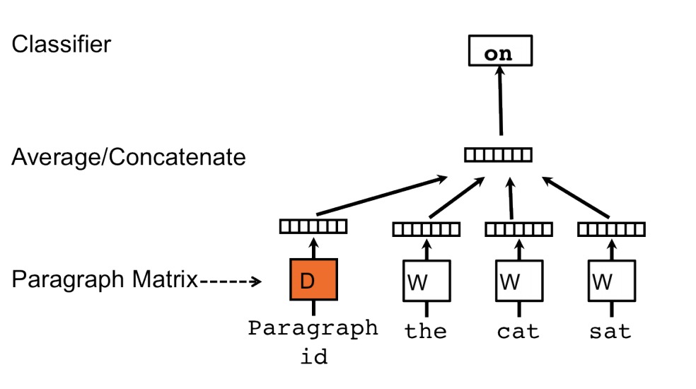
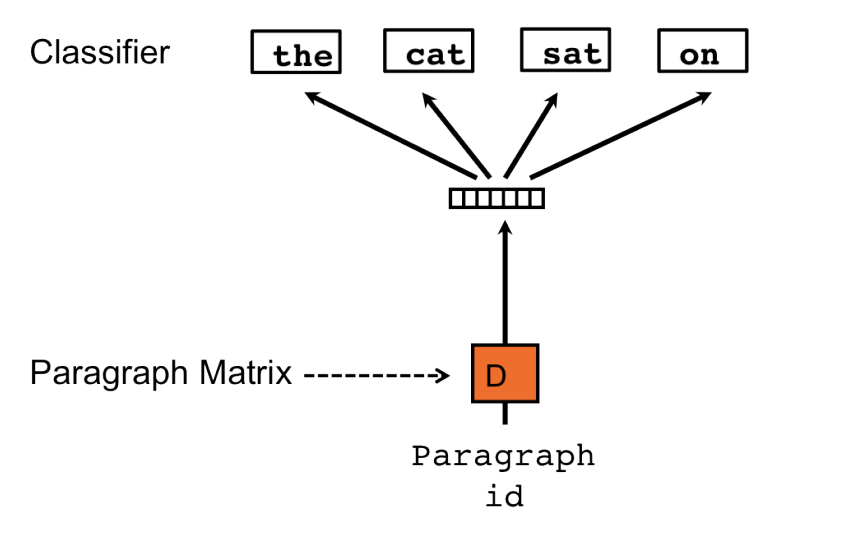

# Embeddings

## 1. Traditional Embedding

典型代表：

* word2vec
* GloVe

## 1.1 word2vec

[illustrated-word2vec](https://jalammar.github.io/illustrated-word2vec/)


### 语言模型

语言模型的其中一个表述就是：**预测下一个词语**

要实现**预测下一个词语**，我们很自然的一个想法就是：**根据前面的词语来计算下一个词语的概率，选取最高的一个**。

可以使用**大小为w的滑动窗口**来实现这个想法，根据窗口的前面w-1个字，来预测第w个字。

具体来说，有两个常见的实现

* N-Gram语言模型
* 神经语言模型

N-Gram语言模型的缺点是，只能预测见过的词语。而神经语言模型就可以解决这个问题。


到目前位置，语言模型是做一个最基本的**完形填空**，即根据前面的字来预测下一个字。例如：

`自 然 __语__`

但是，我们很容易可以发现，**如果我们提供要预测的字后面的字，那么我们的预测会更准确**。例如：

`自 然 __语__ 言`


更进一步，我们提供**被预测的字前后两边相同长度的字**：

`自 然 __语__ 言 处`

也就是说：**根据前后长度为 $w//2$ 的上下文，来预测当前的字**，这就是**连续词袋(Continious Bag-of-Word)模型**。


再发挥一下想象，我们是不是可以反过来，**使用一个字来预测它前后左右的上下文**？例如：

`__自__ __然__ (语) __言__ __处__`

这就是**SkipGram**模型。

也就是说如果使用SkigGram，我们的训练数据就是：


|input |target|
|:-----|:-----|
|语    |自    |
|语    |然    |
|语    |言    |
|语    |处    |


我们的网络的处理步骤应该是：

* 获得输入词语的嵌入表示
* 计算预测
* 把预测结果转换为整个词典上的概率分布

通过概率分布，我们选取最大的一个，然后和target进行计算损失。通过最小化损失训练网络，从而得到每个输入词语的嵌入表示。


### word2vec的训练过程 


上述过程其实有一个问题：**把预测结果转化成整个词典的概率分布**其实是一个计算量非常巨大的过程，每个样本都要在整个词典上计算一次softmax。


所以，实际上的word2vec模型，并不是按照上面的思路进行训练的。word2vec的做法是什么呢？其实很简答，就是把**预测下一个字**的任务拆解成两个步骤：

* 高效地训练得到字的向量表示（避免上面的计算太复杂的问题）
* 使用上面步骤得到的向量表示，来进行下一个字预测


那么word2vec是如何实现上面两个步骤的呢？其实很简单：

* 把上下文和当前字的预测问题转化成一个二分类问题：其他字是不是当前字的上下文
* 负采样


---

根据前面提到的**滑动窗口**，我们总是可以得到这个二分类问题的正样本：**同一个窗口的字永远都是预测字的上下文**。

这样的数据给网络训练，准确率很快就可以达到接近100%，因为我的网络不管输入是什么，输出都是**1**即可。

为了解决这个问题，我们需要一定数量的**负样本**。常用的做法就是：**在整个词典里随机选取几个字作为负样本**。


---


具体到代码实现，就是构造两个嵌入矩阵：

* Embedding matrix，用来获得input的embedding
* Context matrix，用来获得context的embedding


然后我们之前提到的语言模型的三个计算过程：

* 获得输入词语的嵌入表示
* 计算预测结果
* 把预测结果转换为整个词典上的概率分布


到了我们的word2vec里，实际上变成了：

* 分别获得input和context的embedding
* 计算预测结果
* 把预测结果转化为一定数量的字上的概率分布(Negative Sampling)

word2vec网络训练结束之后，我们一般把**Context matrix**丢弃，使用**Embedding matrix**来获得字的embedding。

## 1.2 GloVe

[GloVe paper](https://arxiv.org/abs/1610.03759)


**共现频率的比率** 替代 **共现频率** 本身。

## 2. Contextual Embedding


[A Survey on Contextual Embeddings](https://arxiv.org/pdf/2003.07278.pdf)

传统的embedding，例如word2vec，Glove等，对于每一个token仅有一个全局固定的表示，忽略了上下文。

Contextual embedding可以根据token的不同上下文获得不同的向量表示。


Contextual embedding是一个**整个输入序列**的函数。

获得contextual embedding的主要方法是**语言模型**。

语言模型是一个序列的概率分布。以下几个概念等价：

* 预测下一个词语
* 整个序列的联合概率

$$p(t_1,t_2,...,t_N) = \prod_{i=1}^{N}p(t_i|t_1,t_2,...,t_{i-1})$$

上式即：**联合概率**和**条件概率**之间的关系


语言模型通常使用**最大似然估计（MSE）** 和 **正则化** 来估算模型参数。


**条件概率**通常通过神经网络来学习得到。

### 2.1 ELMo-Embeddings from Language Models

* [Deep contextualized word representations](https://arxiv.org/pdf/1802.05365.pdf)
* [The Illustrated BERT, ELMo, and co.](https://jalammar.github.io/illustrated-bert/)

ELMo通过**预测下一个词语（即语言模型）** 来获得词语的向量表示。


ELMo使用双向的语言模型来建模。


具体来说：
* 每层语言模型，都是一个双向的LSTM模型，对于每个token，都可以获得正向的（$h_{fwd}$）和反向的$h_{bwd}$隐含向量表示

模型结构如下：


那么如何获得一个词语的向量表示呢？主要是以下三个步骤：

* concat每层的正向和反向隐含向量表示，得到$L+1$个向量表示
* 对这$L+1$个表示进行加权和
* 得到最终的向量表示


### 2.2 BERT-Bidirectionla Encoders Representation from Transformer

ELMo仅仅concat双向的LSTM，而不考虑左右两边上下文的交互，GTP和GPT2仅使用从左到右的语言模型（使用Transformer的Deocder）。

BERT使用双向的**Masked Language Model**来建模，能够考虑到双向的上下文，基于Transformer的Encoder。


还有很多BERT的变体，也可以获得contextual embeddings：

* [RoBERTa](https://arxiv.org/pdf/1909.00204.pdf)
* [ALBERT](https://arxiv.org/abs/1909.11942)
* [XLNet](https://arxiv.org/abs/1906.08237)
* [UniLM](https://github.com/microsoft/unilm)
* [ELECTRA](https://arxiv.org/abs/2003.10555)
* [MASS](https://arxiv.org/abs/1905.02450)
* [T5](https://arxiv.org/abs/1910.10683)
* [BART](https://arxiv.org/abs/1910.13461)


|Model    |Masked LM                       |NSP       |
|:--------|:-------------------------------|:---------|
|BERT     |static masking tokens           |NSP       |
|ERNIE    |masking entities and phrases    |NSP       |
|ERNIE 2.0|masking entities and phrases    |more tasks|
|RoBERTa  |dynamic masking tokens          |no NSP    |
|ALBERT   |masking tokens, params-reduction|NSP->SOP  |              

更多BERT的笔记请看：

* [BERT](bert.ipynb)


## 3. sentence2vec

`sentence2vec`的想法是，类似于word2vec，使用一个固定长度的低围稠密向量来表示一个句子。


方法有：

* 直接对word2vec平均加权
* 对word2vec进行加权，例如tf-idf等等
* 直接对句子建模，获得向量表示


论文：

* [Skip-Thought Vectors](https://arxiv.org/pdf/1506.06726v1.pdf)

* [Unsupervised Learning of Sentence Embeddings using Compositional n-Gram Features](https://arxiv.org/abs/1703.02507)


`Skip-Thought`是`word2vec`的直接推广，从`word`推广到`sentence`。`skip-thought`对应`word2vec`的`skip-gram`方式。每个句子使用RNN来编码，RNN的输出来预测上下文句子。


`sent2vec`使用句子中的ngram向量求平均得到句子embedding。

## 4. doc2vec


[Distributed Representations of Sentences and Documents](https://cs.stanford.edu/~quocle/paragraph_vector.pdf)


类似于word2vec，有两种类型：

* Distributed Memory Model
* Distributed Bag of Words

---

DM模型的结构如下图：



DM模型和word2vec的`CBOW`类似，通过上下文字来预测目标字。不同点在于：

* DM模型新增了一个`Paragraph Embedding`，给句子一个嵌入表示

矩阵`W`即`word embedding matrix`，形状是`[num_words, depth]`

矩阵`D`即`paragraph embedding matrix`，形状是`[num_paragraph, depth]`

---

DBOW模型的结构如下图：




DBOW模型使用句子嵌入来预测句子里面的词，类似于word2vec的`Skip-Gram`方式。

矩阵`D`即`paragraph embedding matrix`，形状是`[num_paragraph, depth]`

---

关键点：

* 新的句子如何表示？


## 实用工具

* [gensim](https://github.com/rare-technologies/gensim)
* [fastText](https://fasttext.cc/)


```python

```
